<!-- Generated by scripts/refresh.py. Edit profile.json and scripts/render_profile.py. -->

<picture>
  <source media="(max-width: 600px)" srcset="assets/hero-mobile.svg">
  
</picture>

<a href="#selected-work">Selected work</a> &nbsp; / &nbsp; <a href="#code-spectrum">Code spectrum</a> &nbsp; / &nbsp; <a href="#repository-index">Every public repo</a> &nbsp; / &nbsp; <a href="https://github.com/sankalpjoe?tab=repositories">Explore on GitHub ↗</a>

I explore the overlap between **quantum computing**, **machine learning**, and software that solves practical problems. My public work spans financial distributions, hybrid generative models, urban optimization, information dashboards, and everyday tools.

<picture>
  <source media="(max-width: 600px)" srcset="assets/signal-mobile.svg">
  
</picture>

## Selected work

From quantum experiments to tools you can use. Open a panel to explore its repository.

<a href="https://github.com/sankalpjoe/dashboard">
<picture>
  <source media="(max-width: 600px)" srcset="assets/project-dashboard-mobile.svg">
  
</picture>
</a>

<a href="https://github.com/sankalpjoe/qcbm-indian">
<picture>
  <source media="(max-width: 600px)" srcset="assets/project-qcbm-indian-mobile.svg">
  
</picture>
</a>

<a href="https://github.com/sankalpjoe/CYCLEGAN-Q">
<picture>
  <source media="(max-width: 600px)" srcset="assets/project-CYCLEGAN-Q-mobile.svg">
  
</picture>
</a>

<a href="https://github.com/sankalpjoe/High-Dimensional-Portfolio-Optimization-A-Quantum-Approach">
<picture>
  <source media="(max-width: 600px)" srcset="assets/project-High-Dimensional-Portfolio-Optimization-A-Quantum-Approach-mobile.svg">
  
</picture>
</a>

<a href="https://github.com/sankalpjoe/Delhi-Facility-Location-Optimization-using-Quantum-QAOA">
<picture>
  <source media="(max-width: 600px)" srcset="assets/project-Delhi-Facility-Location-Optimization-using-Quantum-QAOA-mobile.svg">
  
</picture>
</a>

<a href="https://github.com/sankalpjoe/Adverse-Weather-Creation-Using-CycleGAN">
<picture>
  <source media="(max-width: 600px)" srcset="assets/project-Adverse-Weather-Creation-Using-CycleGAN-mobile.svg">
  
</picture>
</a>

<a href="https://github.com/sankalpjoe/doc-toolkit">
<picture>
  <source media="(max-width: 600px)" srcset="assets/project-doc-toolkit-mobile.svg">
  
</picture>
</a>

<a href="https://github.com/sankalpjoe/Youtube-Summarizer">
<picture>
  <source media="(max-width: 600px)" srcset="assets/project-Youtube-Summarizer-mobile.svg">
  
</picture>
</a>

## Code spectrum

<picture>
  <source media="(max-width: 600px)" srcset="assets/spectrum-mobile.svg">
  
</picture>

**Working vocabulary:** Qiskit · Amazon Braket · PennyLane · PyTorch · Transformers · Python · JavaScript / TypeScript · Streamlit

## Repository index

Every public repository is listed here, including archived work and repositories with no content. New public repositories appear on the next successful refresh.

| Repository | What you’ll find | State |
| :--- | :--- | :--- |
| <a href="https://github.com/sankalpjoe/Adverse-Weather-Creation-Using-CycleGAN">Adverse-Weather-Creation-Using-CycleGAN</a> | Unpaired CycleGAN translation for day, night and adverse conditions in driving and aviation imagery. | Public |
| <a href="https://github.com/sankalpjoe/billyzer">billyzer</a> | No content in the public repository yet. | Empty |
| <a href="https://github.com/sankalpjoe/CYCLEGAN-Q">CYCLEGAN-Q</a> | Hybrid quantum and classical generators for unpaired day-to-night image translation. | Public |
| <a href="https://github.com/sankalpjoe/dashboard">dashboard</a> | An India crisis monitor combining news, civic signals, weather and LLM analysis across five cities. | Public |
| <a href="https://github.com/sankalpjoe/Delhi-Facility-Location-Optimization-using-Quantum-QAOA">Delhi-Facility-Location-Optimization-using-Quantum-QAOA</a> | Facility placement on a synthetic Delhi dataset, comparing QAOA in Qiskit and PennyLane. | Public |
| <a href="https://github.com/sankalpjoe/doc-toolkit">doc-toolkit</a> | A Streamlit workspace for PDF merging, compression and conversion between document formats. | Public |
| <a href="https://github.com/sankalpjoe/High-Dimensional-Portfolio-Optimization-A-Quantum-Approach">High-Dimensional-Portfolio-Optimization-A-Quantum-Approach</a> | Hierarchical asset clustering meets quantum optimization, with risk measures and classical comparisons. | Public |
| <a href="https://github.com/sankalpjoe/qcbm-indian">qcbm-indian</a> | A Quantum Circuit Born Machine for synthetic BSE100 data, trained with a genetic algorithm. | Public |
| <a href="https://github.com/sankalpjoe/sankalpjoe">sankalpjoe</a> | This profile, its original artwork and the public-data refresh workflow. | Profile |
| <a href="https://github.com/sankalpjoe/Youtube-Summarizer">Youtube-Summarizer</a> | BART summaries, topic extraction and sentiment charts, together in a Streamlit interface. | Public |
| <a href="https://github.com/sankalpjoe/QCBM-Options-Pricing">QCBM-Options-Pricing</a> | Synthetic financial data research; options-pricing extension described as future work. | Archived |

Public GitHub snapshot: 20 September 2026 at 21:42 UTC. [View source data](data/public-repos.json) · [Refresh workflow](https://github.com/sankalpjoe/sankalpjoe/actions/workflows/refresh-profile.yml). Project illustrations are conceptual; counts and language shares come from GitHub.

<a href="https://github.com/sankalpjoe">
<picture>
  <source media="(max-width: 600px)" srcset="assets/footer-mobile.svg">
  
</picture>
</a>

<a href="#top">Back to the observatory ↑</a>

